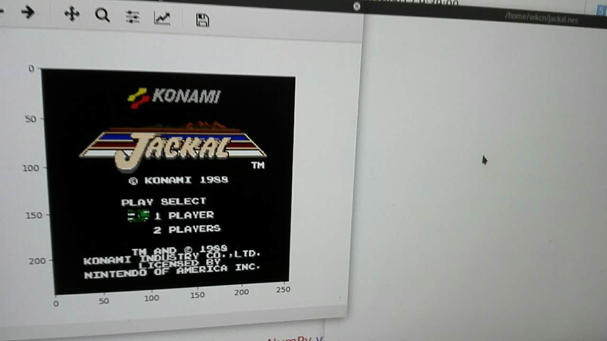

# PyFCSim

This is **an NES emulator written in Python**.

I wrote a numpy type version and a original type version.

However, the performance are both so slow, and 6502 cpu is faster 100x than them :-(

I think it's **NOT RECOMMENDED** to write a emulator in Python.

The code is **referred to the project [fogleman/nes](https://github.com/fogleman/nes)**, which is an NES emulator written in Go.

Thank fogleman!
